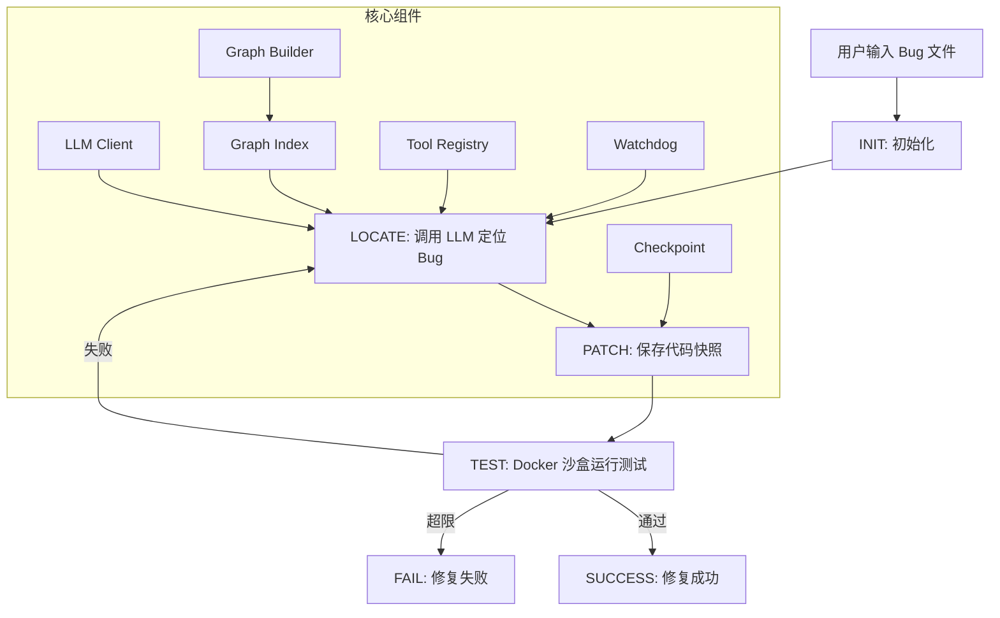

# mini-swe

自动化代码修复的复杂工程 Agent（SWE-Agent 变体）

[](https://python.org)
[](LICENSE)

## 项目简介

mini-swe 是一个基于有限状态机（FSM）的自动化代码修复 Agent 系统，能够在 Docker 沙盒中安全地分析和修复 Python 代码中的 bug。

### 核心特性

- **加权图索引（Phase 1）**：AST 全库扫描构建调用/数据/全局/继承/导入图，分层加载（L0 摘要/L1 邻接/L2 影响半径），影响面计算辅助全局决策
- **FSM 状态机驱动**：6 个状态（INIT → LOCATE → PATCH → TEST → SUCCESS/FAIL），流程清晰可控，支持 DP/Greedy 双模式
- **AST 上下文压缩**：骨架树提取函数签名，压缩 prompt 50%+ Token
- **Docker 安全沙盒**：隔离执行环境，危险命令拦截，网络禁用，只读文件系统
- **防死循环机制**：Watchdog 计数器 + Checkpoint 代码快照 + 指数退避重试
- **Pydantic Schema 校验**：所有工具调用经过类型校验，确保输出可靠性
- **LLM API 容错**：指数退避重试（429/超时/5xx），持续失败抛 `AgentAPIError` 由 FSM 接住

## 架构图



## 快速开始

### 环境要求

- Python 3.11+
- Docker
- DeepSeek API Key

### 安装

```bash
# 克隆仓库
git clone https://github.com/buhui-biancheng/mini-swe.git
cd mini-swe

# 安装依赖
pip install -r requirements.txt

# 配置环境变量
cp .env.example .env
# 编辑 .env 填入你的 DeepSeek API Key
```

### 使用方法

```bash
# 修复单个 bug 文件（直线流程模式）
python -m swe_agent.main fix examples/bug_return_value.py "pytest examples/test_return_value.py -v"

# 使用 FSM 状态机模式
python -m swe_agent.main fix examples/bug_return_value.py "pytest examples/test_return_value.py -v" --fsm

# FSM + DP 模式（图索引引导，指定 --mode 自动启用 FSM）
python -m swe_agent.main fix examples/bug_return_value.py "pytest examples/test_return_value.py -v" --mode dp

# 加权图索引操作
python -m swe_agent.main graph build examples/multi_file_project   # 构建/重建图
python -m swe_agent.main graph stats examples/multi_file_project   # 图统计（节点/边/高入度）
python -m swe_agent.main graph viz examples/multi_file_project     # 导出 mermaid 可视化

# 分析项目 Token 统计
python -m swe_agent.main analyze examples/multi_file_project/
```

### 运行评测

```bash
# 运行 SWE-bench-lite 子集评测
python eval/run_eval.py --max-instances 5
```

## 项目结构

```
mini-swe/
├── swe_agent/
│   ├── ast_view/          # AST 提取（function_map.py + skeleton.py）
│   ├── graph/             # 加权图索引（Phase 1）
│   │   ├── models.py      #   Node/Edge/GraphData Pydantic 模型
│   │   ├── builder.py     #   AST 扫描建图（调用/数据/全局/继承/导入边）
│   │   ├── index.py       #   查询 + 分层加载 + 影响面计算
│   │   ├── manager.py     #   生命周期 + 缓存 + 增量更新
│   │   ├── persistence.py #   graph.json / graph_weights.json 读写
│   │   └── config.py      #   AgentConfig 统一配置
│   ├── fsm/               # FSM 状态机（agent_fsm.py，DP/Greedy 双模式）
│   ├── llm/               # DeepSeek API 客户端（指数退避重试）
│   ├── sandbox/           # Docker 沙盒执行器
│   ├── tools/             # 工具系统（schemas + registry）
│   ├── tui/               # TUI 终端界面（Textual）
│   ├── utils/             # 工具函数（token_counter.py + logger.py）
│   ├── cli.py             # graph build/stats/viz 命令
│   └── main.py            # 主入口
├── tests/                 # 单元测试（166+ 个，含图金标准测试）
│   └── fixtures/          # 图金标准测试小项目
├── examples/              # 示例 bug 文件
├── eval/                  # 评测脚本与数据
├── .gitignore
├── .env.example
├── requirements.txt
├── Dockerfile
├── LICENSE                # MIT License
└── README.md
```

## 技术栈

| 用途 | 库/工具 | 说明 |
|------|---------|------|
| LLM 调用 | openai SDK | DeepSeek 端点 |
| 状态机 | transitions | PyPI: transitions |
| 沙盒 | docker-py | Python Docker SDK |
| AST 解析 | ast (标准库) | 图索引建图 + 骨架提取 |
| Token 统计 | tiktoken | 近似统计 |
| Schema 校验 | pydantic | v2 |
| 日志 | structlog | JSON 格式 |

## 加权图索引（Phase 1）

核心主张：**用一套纯确定性的图索引约束 AI 的行为边界，替代试错式贪心搜索。**

- **建边类型**：`call`（调用）/ `data`（数据流：赋值链 + 嵌套调用）/ `global`（全局变量引用）/ `inherit`（继承）/ `import`（导入）/ `io`（文件操作）
- **点权模型**：边无权重只导航，价值在节点（动态权重 × 入度归一化 × 距离衰减）
- **盲区处理**：多态全笼罩、importlib 全笼罩、反射打标签（`is_reflection`）
- **分层加载**：L0 摘要 / L1 邻接 / L2 影响半径，控制 Token 消耗
- **缓存策略**：git HEAD 未变加载缓存，变了 git diff 增量更新，否则全量扫描
- **金标准测试**：4 个 fixture 项目人工标注期望边，召回率/精确率均 1.0

## 开发进度

- [x] 第 1 周：基础补强 + 最小闭环（直线版）
- [x] 第 2 周：AST 上下文压缩 + 完整 FSM 骨架
- [x] 第 3 周：防死循环 + Docker 加固 + 约束解码
- [x] 第 4 周：评估脚本 + 文档
- [x] 第 5 周：TUI 终端界面 + 流式思考链
- [x] **Phase 1：加权图索引**（确定性工程外壳第一步，166+ 测试通过）
- [ ] Phase 2：FSM 增强（每轮重置 + 双模降级 + 权限围栏）
- [ ] Phase 3-6：语法防火墙 / 快照回溯 / JIT 补全 / 两层沙盒

## License

MIT License - 详见 [LICENSE](LICENSE)

## 联系方式

- GitHub: [@buhui-biancheng](https://github.com/buhui-biancheng)
