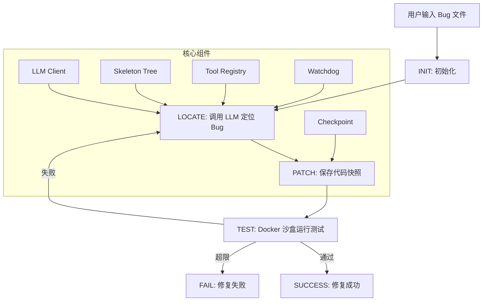

# mini-swe

自动化代码修复的复杂工程 Agent（SWE-Agent 变体）

[](https://python.org)
[](LICENSE)

## 项目简介

mini-swe 是一个基于有限状态机（FSM）的自动化代码修复 Agent 系统，能够在 Docker 沙盒中安全地分析和修复 Python 代码中的 bug。

### 核心特性

- **FSM 状态机驱动**：6 个状态（INIT → LOCATE → PATCH → TEST → SUCCESS/FAIL），流程清晰可控
- **AST 上下文压缩**：骨架树提取函数签名，压缩 prompt 50%+ Token
- **Docker 安全沙盒**：隔离执行环境，危险命令拦截，网络禁用，只读文件系统
- **防死循环机制**：Watchdog 计数器 + Checkpoint 代码快照 + 指数退避重试
- **Pydantic Schema 校验**：所有工具调用经过类型校验，确保输出可靠性

## 架构图



## 快速开始

### 环境要求

- Python 3.11+
- Docker
- DeepSeek API Key

### 安装

```bash
# 克隆仓库
git clone https://github.com/buhui-biancheng/mini-swe.git
cd mini-swe

# 安装依赖
pip install -r requirements.txt

# 配置环境变量
cp .env.example .env
# 编辑 .env 填入你的 DeepSeek API Key
```

### 使用方法

```bash
# 修复单个 bug 文件（直线流程模式）
python -m swe_agent.main fix examples/bug_return_value.py "pytest examples/test_return_value.py -v"

# 使用 FSM 状态机模式
python -m swe_agent.main fix examples/bug_return_value.py "pytest examples/test_return_value.py -v" --fsm

# 分析项目 Token 统计
python -m swe_agent.main analyze examples/multi_file_project/
```

### 运行评测

```bash
# 运行 SWE-bench-lite 子集评测
python eval/run_eval.py --max-instances 5
```

## 项目结构

```
mini-swe/
├── swe_agent/
│   ├── ast_view/          # AST 提取（function_map.py + skeleton.py）
│   ├── fsm/               # FSM 状态机（agent_fsm.py）
│   ├── llm/               # DeepSeek API 客户端
│   ├── sandbox/           # Docker 沙盒执行器
│   ├── tools/             # 工具系统（schemas + registry）
│   ├── utils/             # 工具函数（token_counter.py + logger.py）
│   └── main.py            # 主入口
├── tests/                 # 单元测试（73+ 个）
├── examples/              # 示例 bug 文件
├── eval/                  # 评测脚本与数据
├── .gitignore
├── .env.example
├── requirements.txt
├── Dockerfile
├── LICENSE                # MIT License
└── README.md
```

## 技术栈

| 用途 | 库/工具 | 说明 |
|------|---------|------|
| LLM 调用 | openai SDK | DeepSeek 端点 |
| 状态机 | transitions | PyPI: transitions |
| 沙盒 | docker-py | Python Docker SDK |
| AST 解析 | ast (标准库) | 无需额外安装 |
| Token 统计 | tiktoken | 近似统计 |
| Schema 校验 | pydantic | v2 |
| 日志 | structlog | JSON 格式 |

## 评测结果

在 SWE-bench-lite 子集上的评测结果：

| 指标 | 数值 |
|------|------|
| 评测实例数 | 5 |
| 成功率 | 待运行 |
| 平均耗时 | 待运行 |

## 开发进度

- [x] 第 1 周：基础补强 + 最小闭环（直线版）
- [x] 第 2 周：AST 上下文压缩 + 完整 FSM 骨架
- [x] 第 3 周：防死循环 + Docker 加固 + 约束解码
- [ ] 第 4 周：评估 + 文档 + 简历材料

## License

MIT License - 详见 [LICENSE](LICENSE)

## 联系方式

- GitHub: [@buhui-biancheng](https://github.com/buhui-biancheng)
